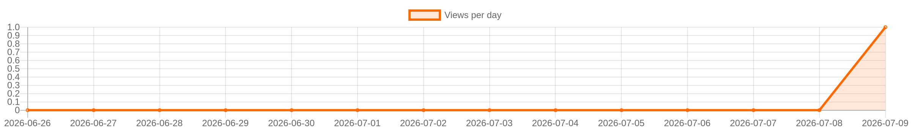
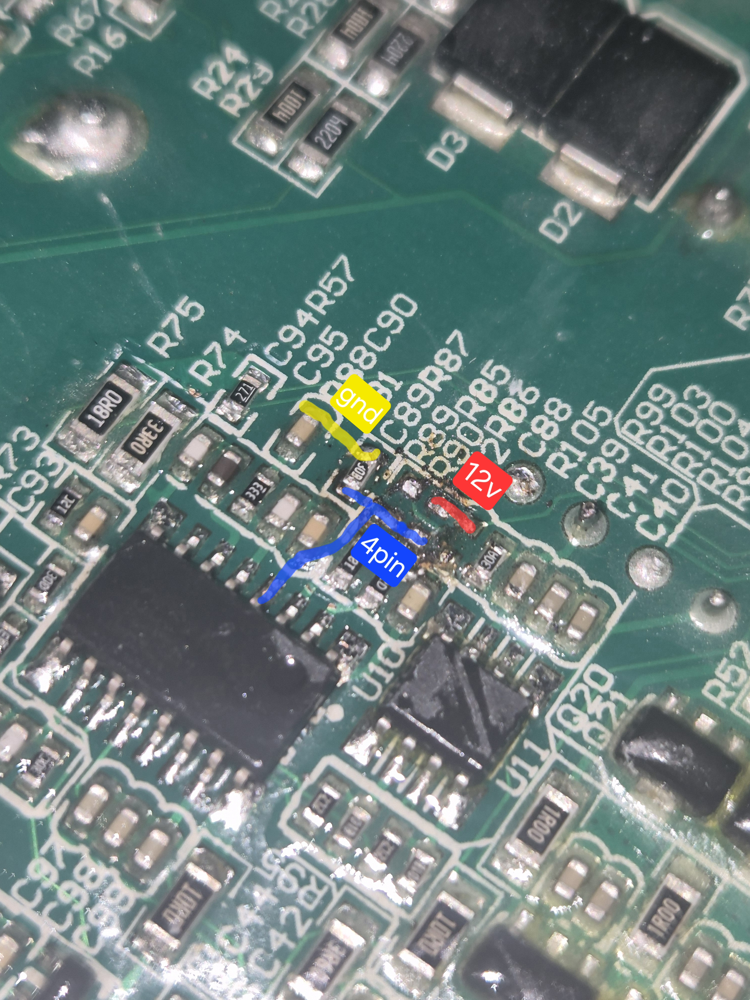

<!-- LANG_START -->
🇷🇺 [Русская версия](README.md)
<!-- LANG_END -->

<div align="center">


</div>


<!-- STATS_START -->
<!-- auto-updated by GitHub Actions · 2026-07-02 00:00 UTC -->

[](https://github.com/gooog1111/bitmain-apw7-voltage-mod-fan7688)
[](https://github.com/gooog1111/bitmain-apw7-voltage-mod-fan7688)
[](https://github.com/gooog1111/bitmain-apw7-voltage-mod-fan7688)
[](https://github.com/gooog1111/bitmain-apw7-voltage-mod-fan7688)
[](https://github.com/gooog1111/bitmain-apw7-voltage-mod-fan7688/stargazers)
[](https://github.com/gooog1111/bitmain-apw7-voltage-mod-fan7688/network/members)
[](https://github.com/gooog1111/bitmain-apw7-voltage-mod-fan7688/releases/latest)
[](https://github.com/gooog1111/bitmain-apw7-voltage-mod-fan7688/releases)

<!-- STATS_END -->


<!-- GRAPH_START -->
<p align="center">
  
</p>
<!-- GRAPH_END -->


<!-- ISSUES_START -->
<!-- auto-updated by GitHub Actions · 2026-07-02 00:00 UTC -->

## Issues

<p>
  <a href="https://github.com/gooog1111/bitmain-apw7-voltage-mod-fan7688/issues">
    
  </a>
  <a href="https://github.com/gooog1111/bitmain-apw7-voltage-mod-fan7688/issues/new/choose">
    
  </a>
</p>

<details open>
<summary><b>Open issues</b></summary>


<p align="center">
  <b>No open issues.</b><br>
  <sub>The service issue <code>views-counter</code> is hidden from the list.</sub>
</p>


</details>

<p>
  <a href="https://github.com/gooog1111/bitmain-apw7-voltage-mod-fan7688/issues/new/choose">Create new issue</a> ·
  <a href="https://github.com/gooog1111/bitmain-apw7-voltage-mod-fan7688/issues">All issues</a>
</p>

<!-- ISSUES_END -->


## Bitmain APW7 Voltage Mod


---

- [English](#english)
- [Русский](#русский)

---

## English

## #Hardware

- PSU: Bitmain APW7
- Revision: 4-MOSFET secondary rectifier version
- Controller: FAN7688 (SOP-16)
- Pin 4: FB (feedback input)

> This applies ONLY to the 4-MOSFET version shown in the photo.

---

## #Purpose

Increase output voltage from **~12.3 V up to ~14.0 V**.

---

## #Original Feedback Divider

```
+12V
  |
 R86 = 8.2k
  |
  +-----> FB (pin 4)
  |
 R87 = 2.0k
  |
 GND
```
Measured: **~12.3 V**

---

## #Formula

Vout = Vref × (1 + R86 / R87)

Real measured:
Vref ≈ 2.412 V

---

## # Calculated Values
```
| R86   | Output  |
| 8.2k  | ~12.3 V |
| 9.1k  | ~13.4 V |
| 9.31k | ~13.6 V |
| 9.53k | ~13.9 V |
| 9.6k  | ~14.0 V |
```
---

## #Voltage Limits

- Minimum: **12.3 V**
- Maximum stable: **13.9–14.0 V**
- Above → **OVP protection (shutdown)**

---

## #Fixed Resistor Mod

Replace:

R86: 8.2k → 9.1k – 9.6k

Recommended:

- 9.1k → safe
- 9.53k → near max
- 9.6k → maximum practical

---

## Adjustable Mod (Trimmer)

## # Wiring



- Red — +12V
-Yellow—GND
- Blue - FB (pin 4 FAN7688)

---

## # Implementation

R86 = 8.2k + 2k trimmer

---

## # Real Behavior (important)

- Deccreasing resistance → **no effect (~12.3 V stays)**
- Increasing resistance:
  - voltage rises normally
  - stable up to **13.9–14.0 V**
- Above → **PSU enters protection**

---

## # Practical Range
```
| Total R86.    | Output |
| 8.2k          | 12.3 V |
| 9.1k     | 13.3–13.4 V |
| 9.5–9.6k | 13.9–14.0 V |
| >9.7k     | Protection |
```
---

## # Important Notes

- Regulation works **only upward**
- Hard OVP threshold (~14 V)
- Adjust voltage under load
- Output capacitors are often **16V rated**
- Higher voltage increases stress on:
  - rectifiers
  -capacitors
  - transformer secondary

---

## Russian

## # Equipment

- PSU: Bitmain APW7
- Revision: 4 MOSFETs
- Controller: FAN7688
- 4 legs - FB

---

## # Purpose

Increasing voltage from **~12.3 V to ~14.0 V**

---

## # Regular divider

```
+12V
  |
 R86 = 8.2k
  |
  +-----> FB (pin 4)
  |
 R87 = 2.0k
  |
 GND
```

Output: **~12.3 V**

---

## # Formula

Vout = Vref × (1 + R86 / R87)

Vref ≈ 2.412 V

---

## # Calculation
```
| R86   | Напряжение |
| 8.2k  | ~12.3 В    |
| 9.1k  | ~13.4 В.   |
| 9.53k | ~13.9 В    |
| 9.6k  | ~14.0 В    |
```
---

## # Limits

- Minimum: 12.3 V
- Maximum: 13.9–14.0 V
- Next → protection

---

## Adjustable option

## # Connection


- Red - 12V
- Yellow - GND
- Blue – FB

---

## # Implementation

8.2k + 2k variable resistor

---

## # Behavior

- Down is not adjustable
- Up to 13.9–14.0 V
- Further protection

---

## # Conclusion

- Adjustment only up
- Hard protection threshold
- Operating maximum ≈ 14 V
