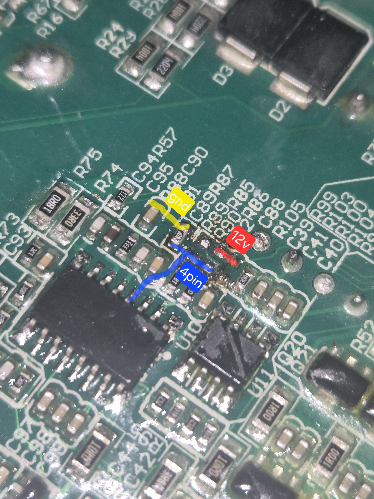

# Bitmain APW7 Voltage Mod (FAN7688, 4-MOSFET)

---

---

- [English](#english)
- [Русский](#русский)

---

## English

### Hardware

- PSU: Bitmain APW7
- Revision: 4-MOSFET secondary rectifier version
- Controller: FAN7688 (SOP-16)
- Pin 4: FB (feedback input)

> This applies ONLY to the 4-MOSFET version shown in the photo.

---

### Purpose

Increase output voltage from **~12.3 V up to ~14.0 V**.

---

### Original Feedback Divider

+12V
  |
 R86 = 8.2k
  |
  +-----> FB (pin 4)
  |
 R87 = 2.0k
  |
 GND

Measured: **~12.3 V**

---

### Formula

Vout = Vref × (1 + R86 / R87)

Real measured:
Vref ≈ 2.412 V

---

### Calculated Values

| R86 | Output |
|---:|---:|
| 8.2k | ~12.3 V |
| 9.1k | ~13.4 V |
| 9.31k | ~13.6 V |
| 9.53k | ~13.9 V |
| 9.6k | ~14.0 V |
| 9.76k | ~14.2 V |
| 10k | ~14.47 V (protection) |

---

### Voltage Limits

- Minimum: **12.3 V**
- Maximum stable: **13.9–14.0 V**
- Above → **OVP protection (shutdown)**

---

### Fixed Resistor Mod

Replace:

R86: 8.2k → 9.1k – 9.6k

Recommended:

- 9.1k → safe
- 9.53k → near max
- 9.6k → maximum practical

---

## Adjustable Mod (Trimmer)

### Wiring

- Red — +12V
- Yellow — GND
- Blue — FB (pin 4 FAN7688)

---

### Implementation

R86 = 8.2k + 2k trimmer

---

### Real Behavior (important)

- Decreasing resistance → **no effect (~12.3 V stays)**
- Increasing resistance:
  - voltage rises normally
  - stable up to **13.9–14.0 V**
- Above → **PSU enters protection**

---

### Practical Range

| Total R86 | Output |
|---:|---:|
| 8.2k | 12.3 V |
| 9.1k | 13.3–13.4 V |
| 9.5–9.6k | 13.9–14.0 V |
| >9.7k | Protection |

---

### Important Notes

- Regulation works **only upward**
- Hard OVP threshold (~14 V)
- Adjust voltage under load
- Output capacitors are often **16V rated**
- Higher voltage increases stress on:
  - rectifiers
  - capacitors
  - transformer secondary

---

## Русский

### Оборудование

- БП: Bitmain APW7
- Ревизия: 4 MOSFET
- Контроллер: FAN7688
- 4 ножка — FB

---

### Назначение

Повышение напряжения с **~12.3 В до ~14.0 В**

---

### Штатный делитель

R86 = 8.2k  
R87 = 2.0k  

Выход: **~12.3 В**

---

### Формула

Vout = Vref × (1 + R86 / R87)

Vref ≈ 2.412 В

---

### Расчёт

| R86 | Напряжение |
|---:|---:|
| 8.2k | ~12.3 В |
| 9.1k | ~13.4 В |
| 9.53k | ~13.9 В |
| 9.6k | ~14.0 В |
| 10k | ~14.47 В (защита) |

---

### Пределы

- Минимум: 12.3 В
- Максимум: 13.9–14.0 В
- Дальше → защита

---

## Регулируемый вариант

### Подключение

- Красный — 12V
- Жёлтый — GND
- Синий — FB

---

### Реализация

8.2k + переменный резистор 2k

---

### Поведение

- Вниз не регулируется
- Вверх до 13.9–14.0 В
- Дальше защита

---

### Вывод

- Регулировка только вверх
- Жёсткий порог защиты
- Рабочий максимум ≈ 14 В
